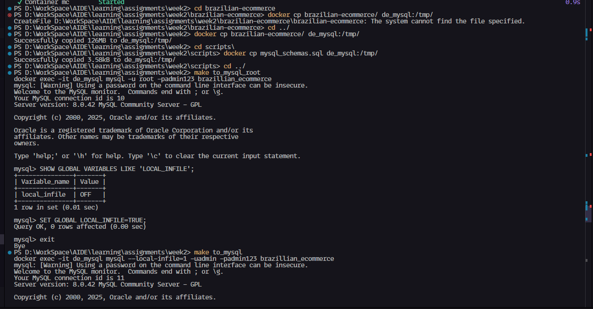
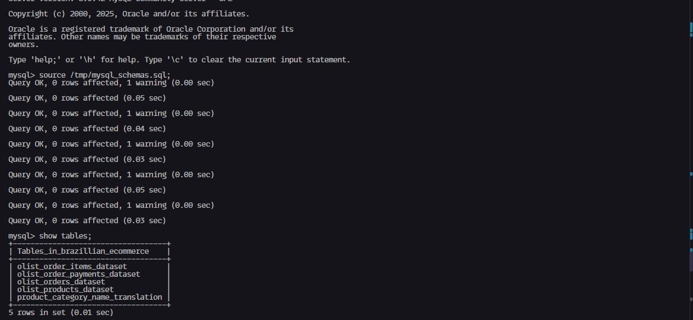
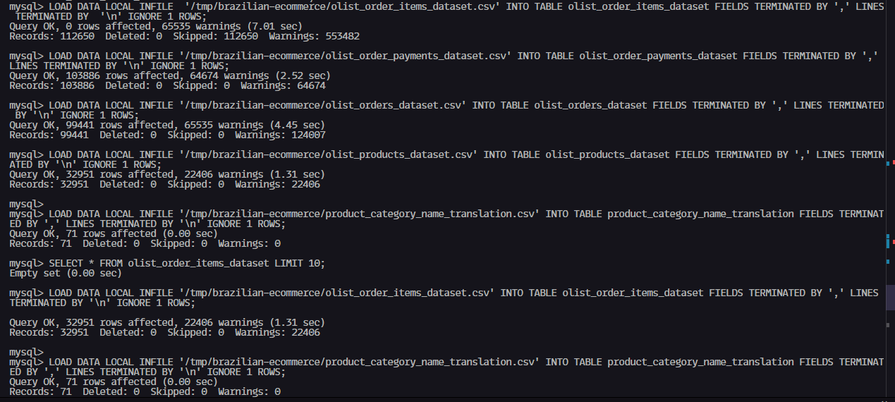
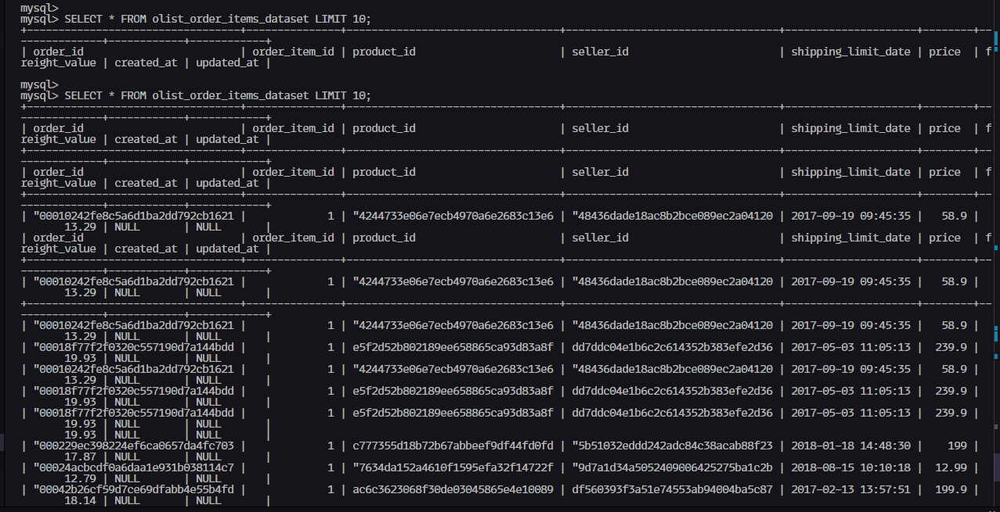
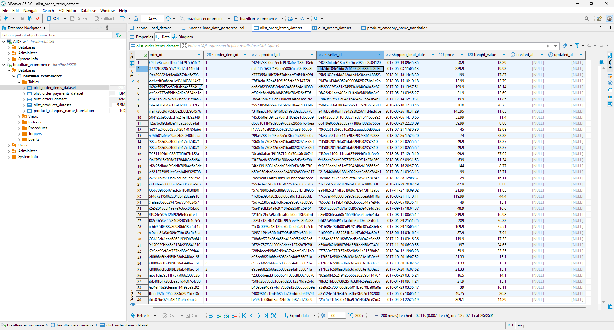

# Step 1: Chuẩn bị các file trong thư mực dự án:
## 1. docker-compose.yml file
```docker
version: "3.9"

services:
  de_mysql:
    image: mysql:8.0
    container_name: de_mysql
    volumes:
      - ./mysql:/var/lib/mysql
    ports:
      - "3306:3306"
    env_file:
      - .env
    networks:
      - de_network

  de_psql:
    image: postgres:15
    container_name: de_psql
    volumes:
      - ./postgresql:/var/lib/postgresql/data
    ports:
      - "5433:5432"
    env_file:
      - .env
    networks:
      - de_network

  minio:
    hostname: minio
    image: minio/minio
    container_name: minio
    ports:
      - "9000:9000"
      - "9001:9001"
    command: ["server", "/data", "--console-address", ":9001"]
    volumes:
      - ./minio:/data
    env_file:
      - .env
    networks:
      - de_network

  mc:
    image: minio/mc
    container_name: mc
    hostname: mc
    env_file:
      - .env
    entrypoint: >
      /bin/sh -c "
        until /usr/bin/mc alias set minio http://minio:9000 minio minio123; do
          echo '...waiting for minio...' && sleep 1;
        done;
        /usr/bin/mc mb -p minio/warehouse;
        /usr/bin/mc anonymous set public minio/warehouse;
        exit 0;
      "
    depends_on:
      - minio
    networks:
      - de_network


networks:
  de_network:
    driver: bridge
    name: de_network

```

## 2. .env file
```.env
# PostgreSQL
POSTGRES_HOST=de_psql
POSTGRES_PORT=5432
POSTGRES_DB=postgres
POSTGRES_USER=admin
POSTGRES_PASSWORD=admin123
POSTGRES_HOST_AUTH_METHOD=trust
# Dagster
DAGSTER_PG_HOSTNAME=de_psql
DAGSTER_PG_USERNAME=admin
DAGSTER_PG_PASSWORD=admin123
DAGSTER_PG_DB=postgres
# MySQL
MYSQL_HOST=de_mysql
MYSQL_PORT=3306
MYSQL_DATABASE=brazillian_ecommerce
MYSQL_ROOT_PASSWORD=admin123
MYSQL_USER=admin
MYSQL_PASSWORD=admin123
# MinIO
MINIO_ENDPOINT=minio:9000
MINIO_ROOT_USER=minio
MINIO_ROOT_PASSWORD=minio123
MINIO_ACCESS_KEY=minio
MINIO_SECRET_KEY=minio123
DATALAKE_BUCKET=warehouse
AWS_ACCESS_KEY_ID=minio
AWS_SECRET_ACCESS_KEY=minio123
AWS_REGION=us-east-1
```

## [OPTIONAL] download_dataset.py
file này dùng để tải dataset từ kaggle xuống và lưu vào thư mục ./brazilian-ecommerce/ hoặc có thể tự chuẩn bị dữ liệu downloaded từ kaggle dưới dạng .zip và giải nén vào folder có path như cách trước.
```python
import kagglehub # pip install kagglehub
import shutil
import os

source_path = kagglehub.dataset_download("olistbr/brazilian-ecommerce")

destination = os.path.join(os.getcwd(), "brazilian-ecommerce")
os.makedirs(destination, exist_ok=True)

shutil.copytree(source_path, destination, dirs_exist_ok=True)

print(f"Dataset: {destination}")

```

## [OPTIONAL] Makefile 
```bash
include .env

build:
	docker-compose build

up:
	docker-compose --env-file .env up -d

down:
	docker-compose --env-file .env down

restart:
	make down && make up

to_psql:
	docker exec -ti de_psql psql -U $(POSTGRES_USER) -d $(POSTGRES_DB)

to_mysql:
	docker exec -it de_mysql mysql --local-infile=1 -u$(MYSQL_USER) -p$(MYSQL_PASSWORD) $(MYSQL_DATABASE)

to_mysql_root:
	docker exec -it de_mysql mysql -u root -p$(MYSQL_ROOT_PASSWORD) $(MYSQL_DATABASE)

```

# Tiến hành nạp dữ liệu vào MySQL




