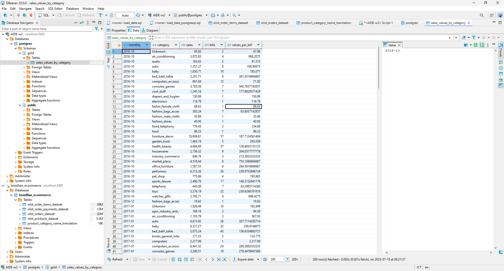

# 1. Cấu trúc thư mục
### brazilian-ecommerce
Bao gồm các file dataset *.csv sau khi được tải về

### images
Thư mục hình ảnh (dùng để báo cáo)

### minio + postgresql + mysql
Các volumes của các services do docker tạo ra khi chạy docker-compose

### Scripts
```
scripts
 ┣ mysql_schemas.sql       --> Định nghĩa các shemas data trong MySQL
 ┗ postgresql_schemas.sql  --> Định nghĩa schema trong PostgreSQL
```


### etl_pipeline (thư mục bài tập chính)
```
etl_pipeline
 ┣ assets
 ┃ ┣ bronze_layer.py   --> bronze layer (lấy data từ MySQL)
 ┃ ┣ gold_layer.py     --> gold layer (tổng hợp data từ silver layer và lưu vào MinIO)
 ┃ ┣ silver_layer.py   --> silver layer (dim và fact table từ bronze layer, lưu ở MinIO)
 ┃ ┣ warehouse.py      --> warehouse (tải dữ liệu từ gold layer và lưu vào PostgreSQL)
 ┃ ┗ __init__.py       --> cho python xử lý nó như một package (import khỏi lỗi)
 ┣ config
 ┃ ┗ __init__.py       --> các thiết lập cho MySQL, MinIO, PostgreSQL
 ┣ resources           --> các IO manager tương ứng với MinIO, PostgreSQL, MySQL
 ┃ ┣ minio_io_manager.py       
 ┃ ┣ mysql_io_manager.py
 ┃ ┣ psql_io_manager.py
 ┃ ┗ __init__.py
 ┣ repository.py       --> Điểm chạy chính của dagster bao gồm các assets, definition
 ┗ __init__.py
```

### Danh sách các file
- `.env` Lưu trữ các biến môi trường của bài tập
- `docker-compose.yml` khởi chạy các service được định nghĩa trong đó (MinIO, MySQL, PostgreSQL)
- `download_dataset.py` tải xuống bộ dữ liệu brazilian-ecommerce từ kaggle
- `Makefile` chạy nhanh các lệnh thường dùng

---

# 2. Quy trình thực hiện
### 2.1. Cài đặt các thư viện cần thiết từ file `re.txt`
```bash
pip install -r re.txt
```

### Khởi chạy các service
```bash
docker-compose up
# or
make up
```

### 2.2. Load dữ liệu đã tải về vào MySQL (chuẩn bị dữ liệu cho MySQL)
Chạy file download_dataset.py để tải dữ liệu về
```bash
python download_dataset.py
```

Thiết lập MySQL server hỗ trợ nạp dữ liệu từ file CSV (folder brazilian-ecommerce/ là Kaggle CSV files sau khi download)
```bash
# copy CSV data to mysql container
# cd path/to/brazilian-ecommerce/
docker cp brazilian-ecommerce/ de_mysql:/tmp/
docker cp mysql_schemas.sql de_mysql:/tmp/
# login to mysql server as root
make to_mysql_root
SHOW GLOBAL VARIABLES LIKE 'LOCAL_INFILE';
SET GLOBAL LOCAL_INFILE=TRUE;
exit
```
Tạo schema và nạp dữ liệu vào tables
```bash
# run commands
make to_mysql
source /tmp/mysql_schemas.sql;
show tables;

LOAD DATA LOCAL INFILE '/tmp/brazilian-ecommerce/olist_order_items_dataset.csv' INTO TABLE olist_order_items_dataset FIELDS TERMINATED BY ',' LINES TERMINATED BY '\n' IGNORE 1 ROWS;

LOAD DATA LOCAL INFILE '/tmp/brazilian-ecommerce/olist_order_payments_dataset.csv' INTO TABLE olist_order_payments_dataset FIELDS TERMINATED BY ',' LINES TERMINATED BY '\n' IGNORE 1 ROWS;

LOAD DATA LOCAL INFILE '/tmp/brazilian-ecommerce/olist_orders_dataset.csv' INTO TABLE olist_orders_dataset FIELDS TERMINATED BY ',' LINES TERMINATED BY '\n' IGNORE 1 ROWS;

LOAD DATA LOCAL INFILE '/tmp/brazilian-ecommerce/olist_products_dataset.csv' INTO TABLE olist_products_dataset FIELDS TERMINATED BY ',' LINES TERMINATED BY '\n' IGNORE 1 ROWS;

LOAD DATA LOCAL INFILE '/tmp/brazilian-ecommerce/product_category_name_translation.csv' INTO TABLE product_category_name_translation FIELDS TERMINATED BY ',' LINES TERMINATED BY '\n' IGNORE 1 ROWS;


# check tables records
SELECT * FROM olist_order_items_dataset LIMIT 10;
SELECT * FROM olist_order_payments_dataset LIMIT 10;
SELECT * FROM olist_orders_dataset LIMIT 10;
SELECT * FROM olist_products_dataset LIMIT 10;
SELECT * FROM product_category_name_translation LIMIT 10;
```
Tạo table tương tự cho PostgreSQL
```sql
# run commands
make to_psql
CREATE TABLE public.olist_orders_dataset (
    order_id text NULL,
    customer_id text NULL,
    order_status text NULL,
    order_purchase_timestamp text NULL,
    order_approved_at text NULL,
    order_delivered_carrier_date text NULL,
    order_delivered_customer_date text NULL,
    order_estimated_delivery_date text NULL
);
```

### 2.3. Cài đặt IOManager cho các service MySQL, MinIO, PostgreSQL
*Như trong thư mục resources đã làm*


### 2.4. Tiến hành định nghĩa các data layer (các assets cho dagster)
*Như trong thư mục assets đã làm*

### 2.5. định nghĩa file `repository.py` (file này sẽ chạy các assets được định nghĩa trong thư mục assets)
*Như trong file `repository.py` đã làm*

### 2.6. Tiến hành kiểm thử (các kết quả kiểm thử có thể thấy ở mục số 3)
- Dagster: `127.0.0.1:3000` 
- MiuIO: `127.0.0.1:9001`
- Mở Dbeaver, tiến hành kết nối PostresSQL và MySQL theo như các config được định nghĩa và kiểm tra dữ liệu
---


# 3. Kết quả sau khi hoàn thành
### Dagster


### MinIO


### Dữ liệu ở PostgreSQL

