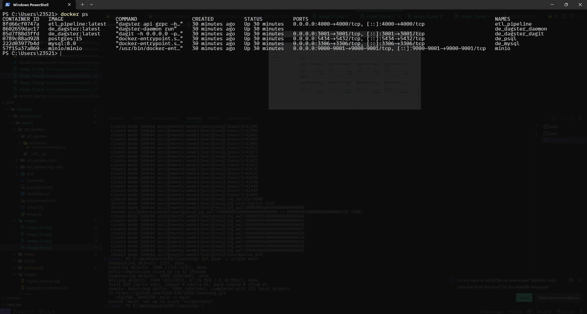
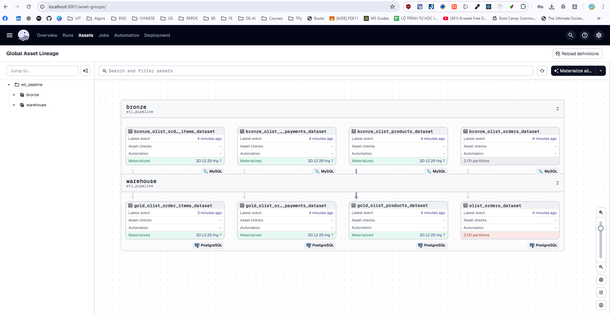
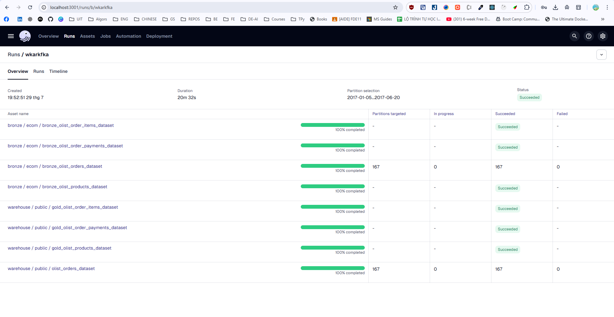
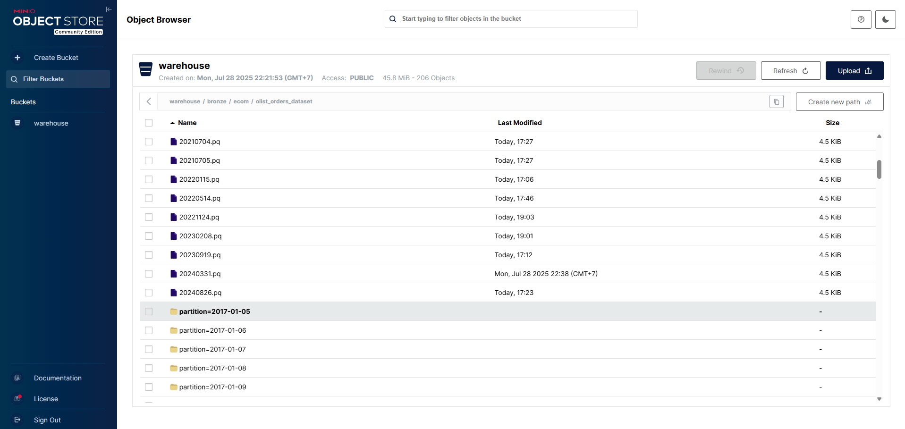
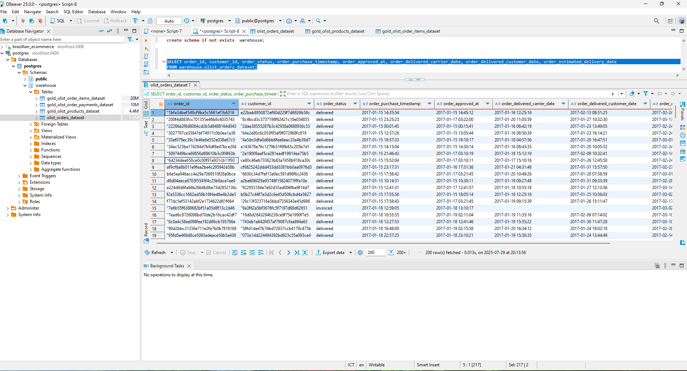

# 1. Cấu trúc thư mục
### brazilian-ecommerce
Bao gồm các file dataset *.csv sau khi được tải về

### images
Thư mục hình ảnh (dùng để báo cáo)

### minio + postgresql + mysql
Các volumes của các services do docker tạo ra khi chạy docker-compose

### Scripts
```
scripts
 ┣ mysql_schemas.sql       --> Định nghĩa các shemas data trong MySQL
```

### dagster (*Chứa logic để xây dựng môi trường chạy Dagster (qua Docker).*)
- **Dockerfile**
    - File cấu hình dùng để tạo image Docker cho Dagster.
    - Thường sẽ cài đặt các dependencies (ví dụ: dagster, dagit, dagster-docker, v.v.).
    - Thiết lập entrypoint để chạy Dagit hoặc Daemon khi container khởi động
- **requirements.txt**
    - Chứa danh sách các thư viện Python cần thiết để chạy Dagster.
    - Bao gồm dagster, dagit, các integrations như dagster-postgres, dagster-aws, v.v. tùy thuộc vào use case.
```
📦dagster
 ┣ 📜Dockerfile
 ┗ 📜requirements.txt
```

### dagster_home (*Chứa cấu hình runtime quan trọng giúp Dagster hoạt động đúng cách.*)
- **dagster.yaml**
    - File cấu hình chính của Dagster runtime.
    - Dùng để cấu hình storage, logging, run launcher, compute log manager,...
    - Bắt buộc phải có trong thư mục DAGSTER_HOME.

- **workspace.yaml**
    - Được Dagit sử dụng để biết project nào sẽ được load.
    - Liên kết đến các repository hoặc python file chứa định nghĩa pipeline/job.
    - Dùng khi chạy dagit hoặc dagster CLI để chỉ định workspace hoạt động.
```
📦dagster_home
 ┣ 📜dagster.yaml     
 ┗ 📜workspace.yaml  
```

### etl_pipline (*pipeline chính*)

```text
📦etl_pipeline
 ┣ 📂build                          -> Thư mục build tạm (do setuptools tạo ra khi đóng gói)
 ┣ 📂etl_pipeline                   -> Mã nguồn chính của pipeline ETL
 ┃ ┣ 📂assets                       -> Định nghĩa các asset (tầng dữ liệu như bronze, warehouse, ...)
 ┃ ┃ ┣ 📜bronze_layer.py           -> Asset cho tầng dữ liệu "bronze" (raw data)
 ┃ ┃ ┣ 📜warehouse.py              -> Asset cho tầng dữ liệu "warehouse" 
 ┃ ┃ ┗ 📜__init__.py               -> Khởi tạo package Python cho thư mục `assets`
 ┃ ┣ 📂config                       -> Cấu hình các asset và IO manager
 ┃ ┃ ┣ 📜assets_config.py          -> Cấu hình cụ thể cho các assets
 ┃ ┃ ┣ 📜io_manager_config.py      -> Cấu hình cho IO managers (đọc/ghi dữ liệu)
 ┃ ┃ ┗ 📜__init__.py               -> Khởi tạo package Python cho thư mục `config`
 ┃ ┣ 📂resources                    -> Định nghĩa các custom IO manager
 ┃ ┃ ┣ 📜minio_io_manager.py       -> IO manager đọc/ghi dữ liệu từ MinIO (S3 compatible)
 ┃ ┃ ┣ 📜mysql_io_manager.py       -> IO manager tương tác với cơ sở dữ liệu MySQL
 ┃ ┃ ┣ 📜psql_io_manager.py        -> IO manager cho PostgreSQL
 ┃ ┃ ┗ 📜__init__.py               -> Khởi tạo package Python cho thư mục `resources`
 ┃ ┗ 📜__init__.py                 -> Khởi tạo package chính `etl_pipeline`
 ┣ 📂etl_pipeline.egg-info         -> Metadata khi đóng gói project bằng setuptools (tự sinh)
 ┣ 📂etl_pipeline_tests            -> Thư mục chứa unit tests cho project
 ┃ ┣ 📜test_assets.py              -> Kiểm thử cho các asset định nghĩa trong pipeline
 ┃ ┗ 📜__init__.py                 -> Khởi tạo package Python cho test module
 ┣ 📜Dockerfile                    -> Dockerfile để container hóa pipeline ETL
 ┣ 📜pyproject.toml                -> Định nghĩa cấu hình build/package (PEP 518); dùng cho poetry hoặc build hệ hiện đại
 ┣ 📜README.md                     -> Tài liệu giới thiệu project (mục tiêu, cách chạy, cấu trúc, ...)
 ┣ 📜requirements.txt              -> Danh sách dependencies của project
 ┣ 📜setup.cfg                     -> Cấu hình bổ sung cho setuptools (định dạng declarative)
 ┗ 📜setup.py                      -> File thiết lập để đóng gói và cài đặt project bằng setuptools
```

### file `.env`
Chứa các biến môi trường

### file `docker-compose.yml`
Định nghĩa các services sẽ được build 

### file `Makefile`
Chứa các lệnh thực thi nhanh


# 2. Quy trình thực hiện
## 2.1 Dockerize dự án
### 2.1.1 Khởi tạo dự án
```
dagster project scaffold --name etl_pipeline 
```
### 2.1.2 Test thử pipeline bằng pytest
**Chạy test thử asset bằng cách**
- tạo `assets.py`
```python
from dagster import asset 
@asset 
def my_first_asset(context): 
context.log.info("This is my first asset") 
return 1
```
- trong `test_assets.py`
```python
from dagster import materialize, build_op_context 
from etl_pipeline.assets import my_first_asset 
    def test_my_first_asset(): 
    result = materialize(assets=[my_first_asset]) 
    assert result.success 
    context = build_op_context() 
    assert my_first_asset(context) == 1
```

- Chạy các lệnh sau
```bash
# unit test 
pytest etl_pipeline_tests 

cd etl_pipeline/ 
dagster dev -m etl_pipeline
```

- Truy cập [localhost:3001](localhost:3001) để kiểm tra

### 2.1.3 Dockerize etl_pipeline
- Tạo `requirements.txt` trong folder etl_pipeline/ 
- Tạo `Dockerfile` trong folder etl_pipeline/ 

### 2.1.4 Dockerize dagster
- Tạo thư mục `dagster` chứa hai file `requirements.txt` và `Dockerfile`
- Tạo folder `dagster_home` chứa hai file `dagster.yaml` và `workspace.yaml`

### 2.1.5 Dóng gói toàn bộ dự án
Tạo file docker-compose trong thư mục root của dự án để đómg gói các service bao gồm:
- Dagster dagit (UI)
- Dagster daemon (lõi)
- etl_pipeline
- postgresql
- mysql
- minio

## 2.2 Tiến hành build dự án
### 2.2.1 build các service được dựng trong các Dockerfile
```docker
docker-compose build
```

### 2.2.2 Dựng toàn bộ các service được định nghĩa trong `docker-compose.yaml`
```
docker-compose up
```

### 2.2.3 Kiểm tra các service bằng lệnh
```
docker-ps
```

kết quả khi build sẽ ra như sau



## 2.3 Dựng pipeline có partition
### 2.3.1 Load dữ liệu từ folder `brazilian-ecommerce` vào `mysql`
Thiết lập MySQL server hỗ trợ nạp dữ liệu từ file CSV (folder brazilian-ecommerce/ là Kaggle CSV files sau khi download)
```bash
# copy CSV data to mysql container
# cd path/to/brazilian-ecommerce/
docker cp brazilian-ecommerce/ de_mysql:/tmp/
docker cp scripts/mysql_schemas.sql de_mysql:/tmp/
# login to mysql server as root
make to_mysql_root
SHOW GLOBAL VARIABLES LIKE 'LOCAL_INFILE';
SET GLOBAL LOCAL_INFILE=TRUE;
exit
```
Tạo schema và nạp dữ liệu vào tables
```bash
# run commands
make to_mysql
source /tmp/mysql_schemas.sql;
show tables;

LOAD DATA LOCAL INFILE '/tmp/brazilian-ecommerce/olist_order_items_dataset.csv' INTO TABLE olist_order_items_dataset FIELDS TERMINATED BY ',' LINES TERMINATED BY '\n' IGNORE 1 ROWS;

LOAD DATA LOCAL INFILE '/tmp/brazilian-ecommerce/olist_order_payments_dataset.csv' INTO TABLE olist_order_payments_dataset FIELDS TERMINATED BY ',' LINES TERMINATED BY '\n' IGNORE 1 ROWS;

LOAD DATA LOCAL INFILE '/tmp/brazilian-ecommerce/olist_orders_dataset.csv' INTO TABLE olist_orders_dataset FIELDS TERMINATED BY ',' LINES TERMINATED BY '\n' IGNORE 1 ROWS;

LOAD DATA LOCAL INFILE '/tmp/brazilian-ecommerce/olist_products_dataset.csv' INTO TABLE olist_products_dataset FIELDS TERMINATED BY ',' LINES TERMINATED BY '\n' IGNORE 1 ROWS;

LOAD DATA LOCAL INFILE '/tmp/brazilian-ecommerce/product_category_name_translation.csv' INTO TABLE product_category_name_translation FIELDS TERMINATED BY ',' LINES TERMINATED BY '\n' IGNORE 1 ROWS;


# check tables records
SELECT * FROM olist_order_items_dataset LIMIT 10;
SELECT * FROM olist_order_payments_dataset LIMIT 10;
SELECT * FROM olist_orders_dataset LIMIT 10;
SELECT * FROM olist_products_dataset LIMIT 10;
SELECT * FROM product_category_name_translation LIMIT 10;
```

### 2.3.2 Tạo schema cho Postgresql
```sql
create schema if not exists  warehouse;
```

### 2.3.3 Cài đặt IOManager cho các service MySQL, MinIO, PostgreSQL
*Như trong thư mục resources đã làm*


### 2.3.4 Tiến hành định nghĩa các data layer (các assets cho dagster)
*Như trong thư mục assets đã làm*

### 2.3.5 định nghĩa file `__init__.py` (file này sẽ chạy các assets được định nghĩa trong thư mục assets)
*Như trong file `__init__.py` đã làm*

### 2.3.6 dựng toàn bộ các service lên
```bash
docker-compose up
# or
make up
```

### 2.3.7 Tiến hành kiếm tra
- truy cập [localhost:3001](localhost:3001) để truy cập UI dagster
- Kết nối MySQL và PostgreSQL
- truy cập [localhost:9001](localhost:9001) để truy cập MinIO UI
- Materialize các assets được định nghĩa


# 3. Kết quả thực hiện
### 3.1 Các services được dựng lên bao gòm dagster, etl_pipeline, psql, mysql, minio


### 3.2 Kết quả materialize các assets




### 3.3 Dữ liệu ở MinIO sau khi materialize và backfilling


### 3.4 Dữ liệu ở PostgreSQL, 
Có thể thấy đữ liệu ở bảng olist_orders_dataset đã được nạp vào Postgresql theo order_purchase_timestamp (cách phân vùng)
