# Learning Progress
## Knowledges check
### Module 2
- Traditional Data Teams
    - Data engineers are responsible for maintaining data infrastructure and the ETL process for creating tables and views.
    - Data analysts focus on querying tables and views to drive business insights for stakeholders.
- ETL and ELT
    - ETL (extract transform load) is the process of creating new database objects by extracting data from multiple data sources, transforming it on a local or third party machine, and loading the transformed data into a data warehouse.
    - ELT (extract load transform) is a more recent process of creating new database objects by first extracting and loading raw data into a data warehouse and then transforming that data directly in the warehouse.
    - The new ELT process is made possible by the introduction of cloud-based data warehouse technologies.
- Analytics Engineering
    - Analytics engineers focus on the transformation of raw data into transformed data that is ready for analysis. This new role on the data team changes the responsibilities of data engineers and data analysts.
    - Data engineers can focus on larger data architecture and the EL in ELT.
    - Data analysts can focus on insight and dashboard work using the transformed data.
    - Note: At a small company, a data team of one may own all three of these roles and responsibilities. As your team grows, the lines between these roles will remain blurry.
- dbt
    - dbt empowers data teams to leverage software engineering principles for transforming data.
    - The focus of this course is to build your analytics engineering mindset and dbt skills to give you more leverage in your work.

#### Knowledge check
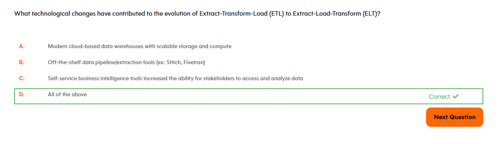
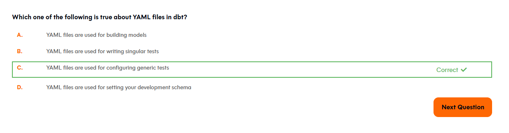
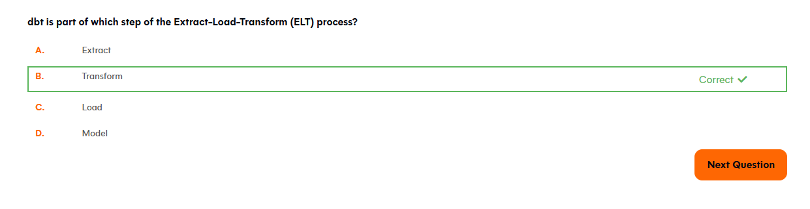
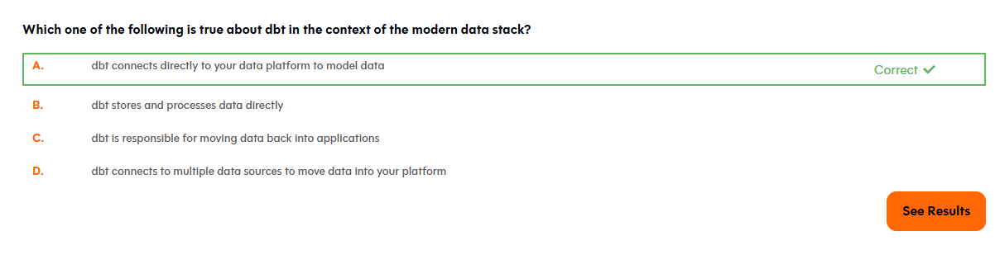

### Module 3 (Set Up dbt Cloud)

#### Create the dbt trial and snowflake trial account
For the snowflake trial account, choose the Enterprise Snowflake edition so you have ACCOUNTADMIN access
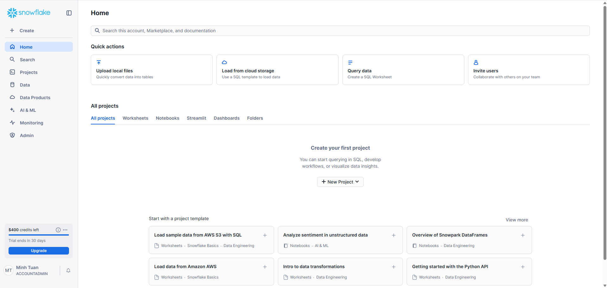
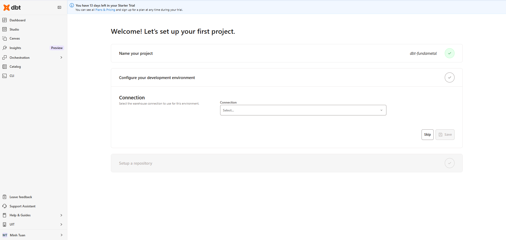

#### Create a new Snowflake worksheet
- Log in to your trial Snowflake account.
- In the Snowflake UI, click + Create in the left-hand corner, underneath the Snowflake logo, which opens a dropdown. Select the first option, SQL Worksheet.
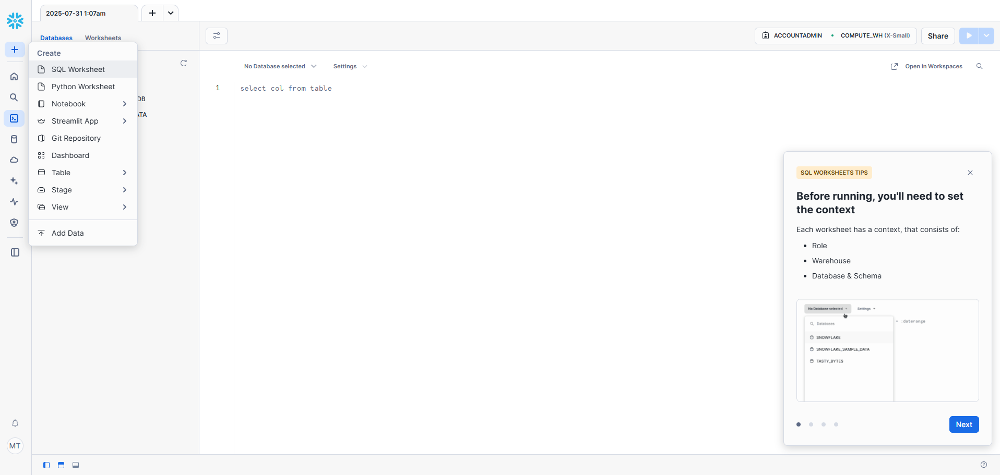

#### Load data to SnowFlake
The data used here is stored as CSV files in a public S3 bucket and the following steps will guide you through how to prepare your Snowflake account for that data and upload it.
1. Create a new virtual warehouse, two new databases (one for raw data, the other for future dbt development), and two new schemas (one for jaffle_shop data, the other for stripe data).
To do this, run these SQL commands by typing them into the Editor of your new Snowflake worksheet and clicking Run in the upper right corner of the UI:
```sql
create warehouse transforming;
create database raw;
create database analytics;
create schema raw.jaffle_shop;
create schema raw.stripe;
```
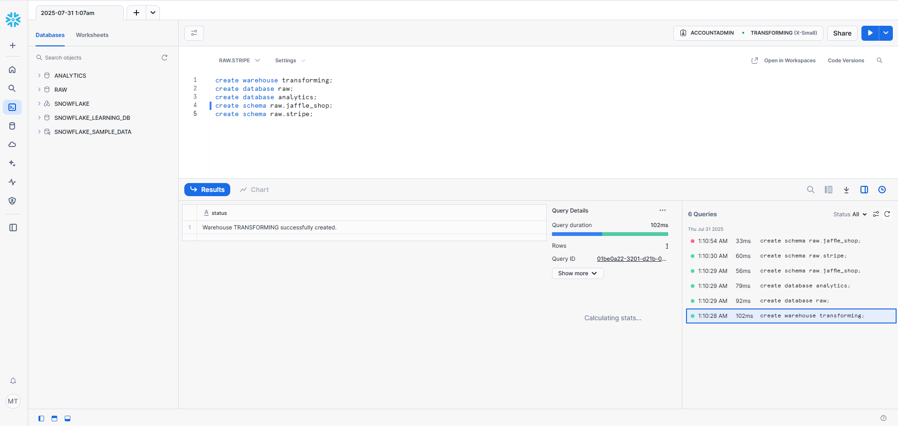

2. In the raw database and jaffle_shop and stripe schemas, create three tables and load relevant data into them:
- First, delete all contents (empty) in the Editor of the Snowflake worksheet. Then, run this SQL command to create the customer table:
```sql
create table raw.jaffle_shop.customers 
( id integer,
  first_name varchar,
  last_name varchar
);
```

- Delete all contents in the Editor, then run this command to load data into the customer table:
```sql
copy into raw.jaffle_shop.customers (id, first_name, last_name)
from 's3://dbt-tutorial-public/jaffle_shop_customers.csv'
file_format = (
    type = 'CSV'
    field_delimiter = ','
    skip_header = 1
    ); 
```

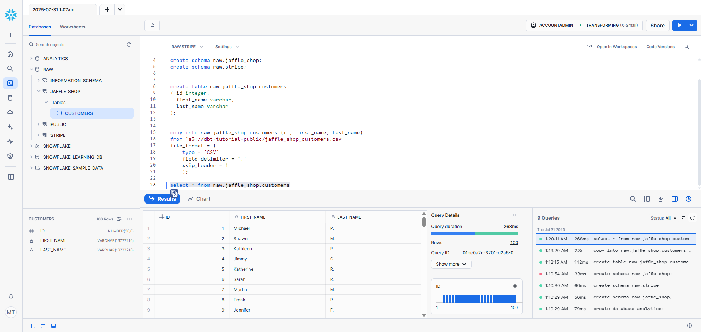

- Delete all contents in the Editor (empty), then run this command to create the orders table:
```sql
create table raw.jaffle_shop.orders
( id integer,
  user_id integer,
  order_date date,
  status varchar,
  _etl_loaded_at timestamp default current_timestamp
); 
```
- Delete all contents in the Editor, then run this command to load data into the orders table:
```sql
copy into raw.jaffle_shop.orders (id, user_id, order_date, status)
from 's3://dbt-tutorial-public/jaffle_shop_orders.csv'
file_format = (
    type = 'CSV'
    field_delimiter = ','
    skip_header = 1
    );
```

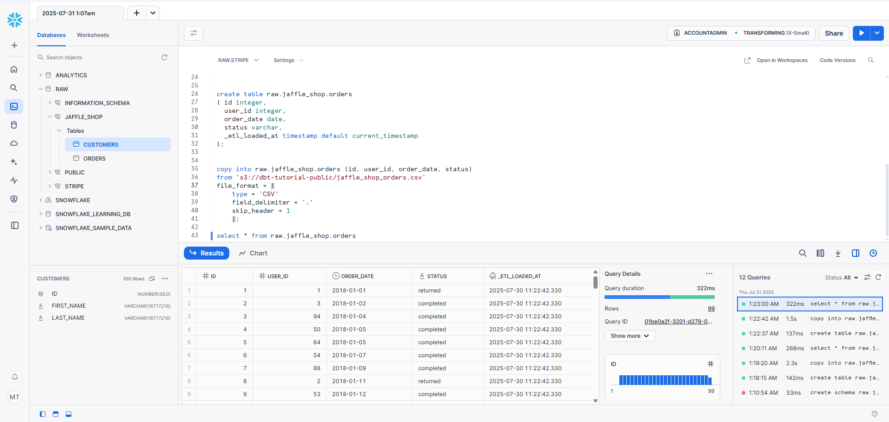

- Delete all contents in the Editor (empty), then run this command to create the payment table:
```sql
create table raw.stripe.payment 
( id integer,
  orderid integer,
  paymentmethod varchar,
  status varchar,
  amount integer,
  created date,
  _batched_at timestamp default current_timestamp
);
```

- Delete all contents in the Editor, then run this command to load data into the payment table:
```sql
copy into raw.stripe.payment (id, orderid, paymentmethod, status, amount, created)
from 's3://dbt-tutorial-public/stripe_payments.csv'
file_format = (
    type = 'CSV'
    field_delimiter = ','
    skip_header = 1
    );
```
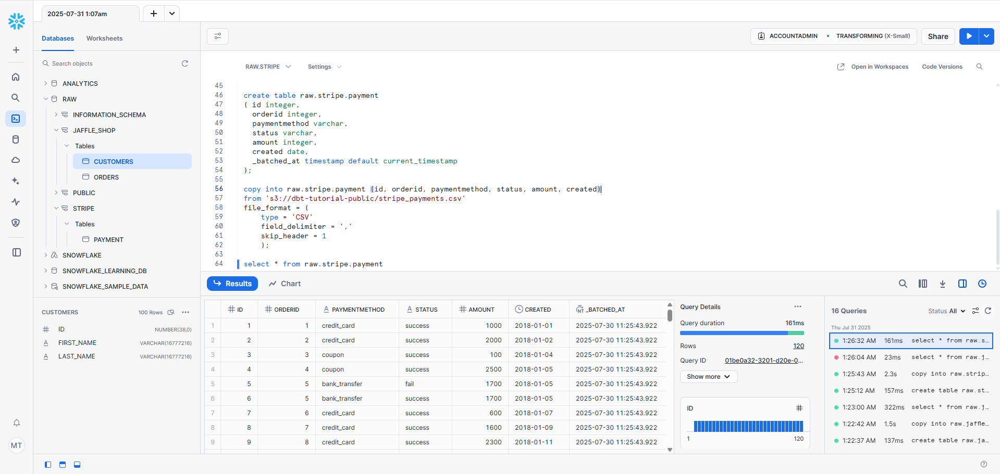


3. Verify that the data is loaded by running these SQL queries. Confirm that you can see output for each one.
```sql
select * from raw.jaffle_shop.customers;
select * from raw.jaffle_shop.orders;
select * from raw.stripe.payment;  
```

#### Connect dbt to Snowflake
Follow this guideline: [https://docs.getdbt.com/guides/snowflake?step=4#connect-dbt-to-snowflake](https://docs.getdbt.com/guides/snowflake?step=4#connect-dbt-to-snowflake)

There are two ways to connect dbt to Snowflake. The first option is Partner Connect, which provides a streamlined setup to create your dbt account from within your new Snowflake trial account. The second option is to create your dbt account separately and build the Snowflake connection yourself (connect manually). If you want to get started quickly, dbt Labs recommends using Partner Connect. If you want to customize your setup from the very beginning and gain familiarity with the dbt setup flow, dbt Labs recommends connecting manually.

Here, i will use the manual connection to connect dbt to the Snowflake
1. Create a new project in dbt. Navigate to Account settings (by clicking on your account name in the left side menu), and click + New Project. Enter a project name and click Continue.** *(has been created yet)***

2. For the warehouse, click Snowflake then Next to set up your connection.

3. Enter your Settings for Snowflake with:

- Account — Find your account by using the Snowflake trial account URL and removing snowflakecomputing.com. The order of your account information will vary by Snowflake version. For example, Snowflake's Classic console URL might look like: oq65696.west-us-2.azure.snowflakecomputing.com. The AppUI or Snowsight URL might look more like: snowflakecomputing.com/west-us-2.azure/oq65696. In both examples, your account will be: oq65696.west-us-2.azure. For more information, see Account Identifiers in the Snowflake docs.

  ✅ db5261993 or db5261993.east-us-2.azure

  ❌ db5261993.eu-central-1.snowflakecomputing.com

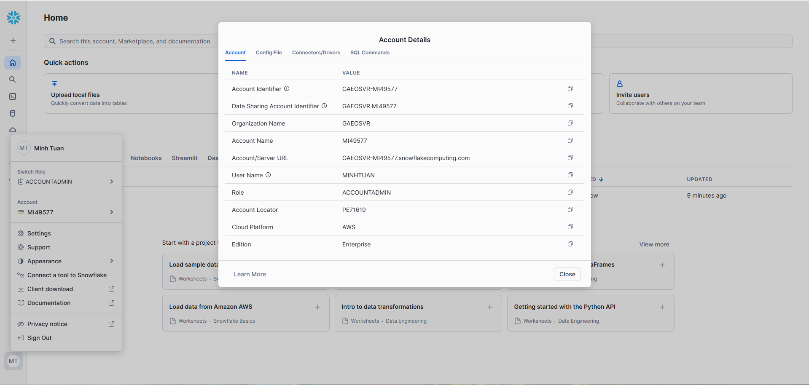

- Role — Leave blank for now. You can update this to a default Snowflake role later.

- Database — analytics. This tells dbt to create new models in the analytics database.

- Warehouse — transforming. This tells dbt to use the transforming warehouse that was created earlier.

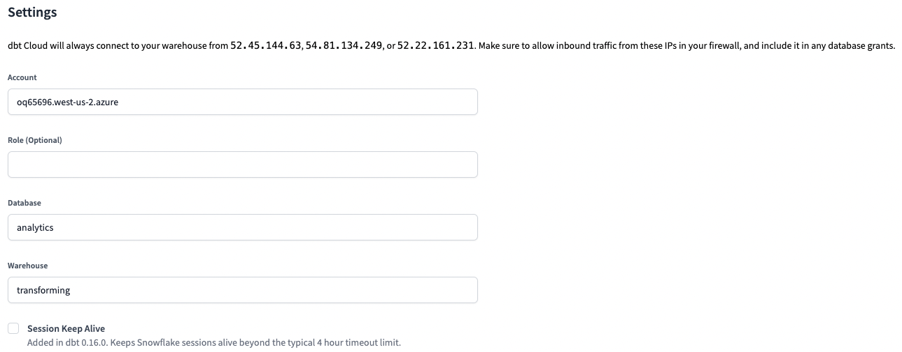

4. Enter your Development Credentials for Snowflake with:

- Username — The username you created for Snowflake. The username is not your email address and is usually your first and last name together in one word.
- Password — The password you set when creating your Snowflake account.
- Schema — You’ll notice that the schema name has been auto created for you. By convention, this is dbt_<first-initial><last-name>. This is the schema connected directly to your development environment, and it's where your models will be built when running dbt within the Studio IDE.
- Target name — Leave as the default.
- Threads — Leave as 4. This is the number of simultaneous connects that dbt will make to build models concurrently.

5. Click Test Connection. This verifies that dbt can access your Snowflake account.
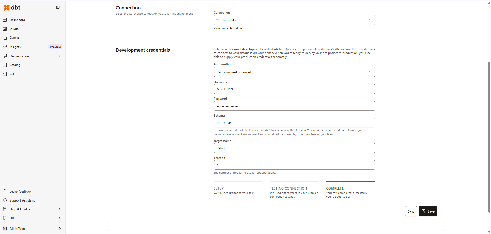

#### Set up a dbt managed repository
Follow this guideline here: [https://docs.getdbt.com/guides/snowflake?step=5#set-up-a-dbt-managed-repository](https://docs.getdbt.com/guides/snowflake?step=5#set-up-a-dbt-managed-repository)


If using the Partner Connect, can skip to initializing the dbt project as the Partner Connect provides u with a managed repository. Otherwise, you will need to create your repository connection.

When you develop in dbt, you can leverage Git to version control your code.

To connect to a repository, you can either set up a dbt-hosted managed repository or directly connect to a supported git provider. Managed repositories are a great way to trial dbt without needing to create a new repository. In the long run, it's better to connect to a supported git provider to use features like automation and continuous integration.

To set up a managed repository:

- Under "Setup a repository", select Managed.
- Type a name for your repo such as bbaggins-dbt-quickstart
- Click Create. It will take a few seconds for your repository to be created and imported.
- Once you see the "Successfully imported repository," click Continue.

#### Initialize your dbt project​ and start developing
Follow this guideline: [https://docs.getdbt.com/guides/snowflake?step=6#initialize-your-dbt-project-and-start-developing](https://docs.getdbt.com/guides/snowflake?step=6#initialize-your-dbt-project-and-start-developing)

Now that you have a repository configured, you can initialize your project and start development in dbt:

- Click Start developing in the Studio IDE. It might take a few minutes for your project to spin up for the first time as it establishes your git connection, clones your repo, and tests the connection to the warehouse.
- Above the file tree to the left, click Initialize your project. This builds out your folder structure with example models.
- Make your initial commit by clicking Commit and sync. Use the commit message initial commit. This creates the first commit to your managed repo and allows you to open a branch where you can add new dbt code.
- You can now directly query data from your warehouse and execute dbt run. You can try this out now:
    - Click + Create new file, add this query to the new file, and click Save as to save the new file
    ```sql
    select * from raw.jaffle_shop.customers
    ```
    - In the command line bar at the bottom, enter dbt run and click Enter. You should see a dbt run succeeded message.

    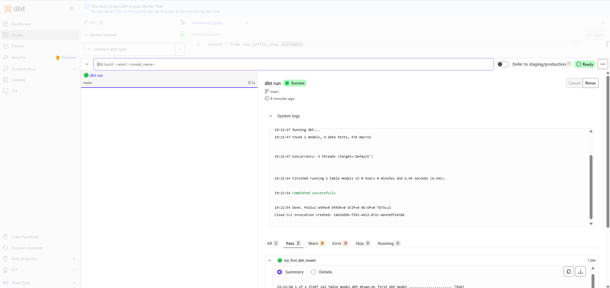


### Module 4 (Model)

#### Building the first model
```sql
with customers as (

    select
        id as customer_id,
        first_name,
        last_name

    from raw.jaffle_shop.customers

),

orders as (

    select
        id as order_id,
        user_id as customer_id,
        order_date,
        status

    from raw.jaffle_shop.orders

),

customer_orders as (

    select
        customer_id,

        min(order_date) as first_order_date,
        max(order_date) as most_recent_order_date,
        count(order_id) as number_of_orders

    from orders

    group by 1

),

final as (

    select
        customers.customer_id,
        customers.first_name,
        customers.last_name,
        customer_orders.first_order_date,
        customer_orders.most_recent_order_date,
        coalesce(customer_orders.number_of_orders, 0) as number_of_orders

    from customers

    left join customer_orders using (customer_id)

)

select * from final
```

#### Practise
1. Create these following models in the `models` folder:
    - `models/staging/jaffle_shop:`
        - `stg_jaffle_shop_customer.sql`:
            ```sql
            select
                id as customer_id,
                first_name,
                last_name
            from raw.jaffle_shop.customers
            ```
        - `stg_jaffle_shop_order.sql`:
            ```sql
            select
                id as order_id,
                user_id as customer_id,
                order_date,
                status
            from raw.jaffle_shop.orders
            ```
    - `models/staging/stripe` :
        - `stg_stripe__payments.sql`:
            ```sql
            select
                id as payment_id,
                orderid as order_id,
                paymentmethod as payment_method,
                status,
                amount / 100 as amount,
                created as created_at
            from raw.stripe.payment
            ```
    - `models/marts/finance` :
        - `fct_orders.sql`:
            ```sql
            with orders as  (
                select * from {{ ref ('stg_jaffle_shop_order' )}}
            ),

            payments as (
                select * from {{ ref ('stg_stripe__payments') }}
            ),

            order_payments as (
                select
                    order_id,
                    sum (case when status = 'success' then amount end) as amount

                from payments
                group by 1
            ),

            final as (

                select
                    orders.order_id,
                    orders.customer_id,
                    orders.order_date,
                    coalesce (order_payments.amount, 0) as amount

                from orders
                left join order_payments using (order_id)
            )

            select * from final
            ```
        - `dim_customers.sql`:
            ```sql
            with customers as (
                select * from {{ ref ('stg_jaffle_shop_customer')}}
            ),
            orders as (
                select * from {{ ref ('fct_orders')}}
            ),
            customer_orders as (
                select
                    customer_id,
                    min (order_date) as first_order_date,
                    max (order_date) as most_recent_order_date,
                    count(order_id) as number_of_orders,
                    sum(amount) as lifetime_value
                from orders
                group by 1
            ),
            final as (
                select
                    customers.customer_id,
                    customers.first_name,
                    customers.last_name,
                    customer_orders.first_order_date,
                    customer_orders.most_recent_order_date,
                    coalesce (customer_orders.number_of_orders, 0) as number_of_orders,
                    customer_orders.lifetime_value
                from customers
                left join customer_orders using (customer_id)
            )
            select * from final
            ```

2. Run dbt run
    ```bash
    dbt run
    ```

3. View the result in the snowflake
    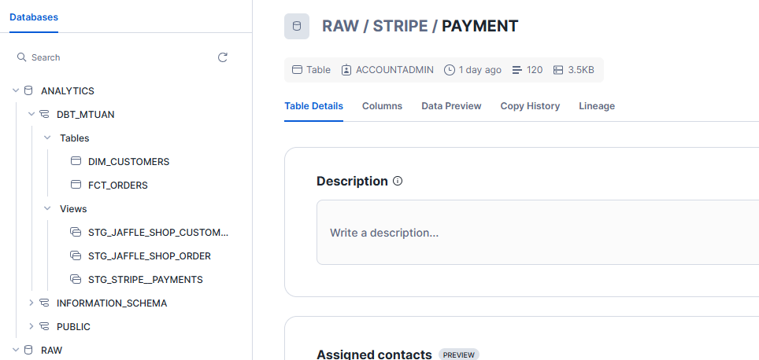


#### Review 
1. Models
    - Models are .sql files that live in the models folder.
    - Models are simply written as select statements - there is no DDL/DML that needs to be written around this. This allows the developer to focus on the logic.
    - In the Cloud IDE, the Preview button will run this select statement against your data warehouse. The results shown here are equivalent to what this model will return once it is materialized.
    - After constructing a model, dbt run in the command line will actually materialize the models into the data warehouse. The default materialization is a view.
    - The materialization can be configured as a table with the following configuration block at the top of the model file:
        ```sql
        {{ config(
            materialized='table'
        ) }}
        ```
        or as a view
        ```sql
        {{ config(
            materialized='view'
        ) }}
        ```
    - When dbt run is executing, dbt is wrapping the select statement in the correct DDL/DML to build that model as a table/view. If that model already exists in the data warehouse, dbt will automatically drop that table or view before building the new database object. *Note: If you are on BigQuery, you may need to run dbt run --full-refresh for this to take effect.

    - The DDL/DML that is being run to build each model can be viewed in the logs through the cloud interface or the target folder.
        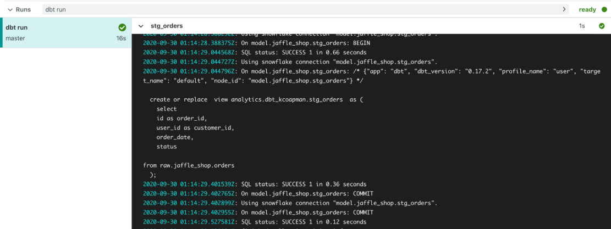
    
2. ref Macro
    - Models can be written to reference the underlying tables and views that were building the data warehouse (e.g. analytics.dbt_jsmith.stg_jaffle_shop_customers). This hard codes the table names and makes it difficult to share code between developers.
    - The ref function allows us to build dependencies between models in a flexible way that can be shared in a common code base. The ref function compiles to the name of the database object as it has been created on the most recent execution of dbt run in the particular development environment. This is determined by the environment configuration that was set up when the project was created.
    - Example: {{ ref('stg_jaffle_shop_customers') }} compiles to analytics.dbt_jsmith.stg_jaffle_shop_customers.
    - The ref function also builds a lineage graph like the one shown below. dbt is able to determine dependencies between models and takes those into account to build models in the correct order.
        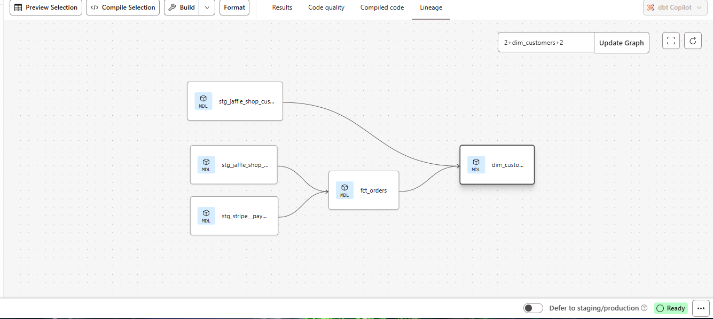

3. Modeling History
    - There have been multiple modeling paradigms since the advent of database technology. Many of these are classified as normalized modeling.
    - Normalized modeling techniques were designed when storage was expensive and computational power was not as affordable as it is today.
    - With a modern cloud-based data warehouse, we can approach analytics differently in an agile or ad hoc modeling technique. This is often referred to as denormalized modeling.
    - dbt can build your data warehouse into any of these schemas. dbt is a tool for how to build these rather than enforcing what to build.
4. Naming Conventions 
    - In working on this project, we established some conventions for naming our models.

    - Sources (src) refer to the raw table data that have been built in the warehouse through a loading process. (We will cover configuring Sources in the Sources module)
    - Staging (stg) refers to models that are built directly on top of sources. These have a one-to-one relationship with sources tables. These are used for very light transformations that shape the data into what you want it to be. These models are used to clean and standardize the data before transforming data downstream. Note: These are typically materialized as views.
    - Intermediate (int) refers to any models that exist between final fact and dimension tables. These should be built on staging models rather than directly on sources to leverage the data cleaning that was done in staging.
    - Fact (fct) refers to any data that represents something that occurred or is occurring. Examples include sessions, transactions, orders, stories, votes. These are typically skinny, long tables.
    - Dimension (dim) refers to data that represents a person, place or thing. Examples include customers, products, candidates, buildings, employees.
    
    > *Note: The Fact and Dimension convention is based on previous normalized modeling techniques.*


#### Knowledge check
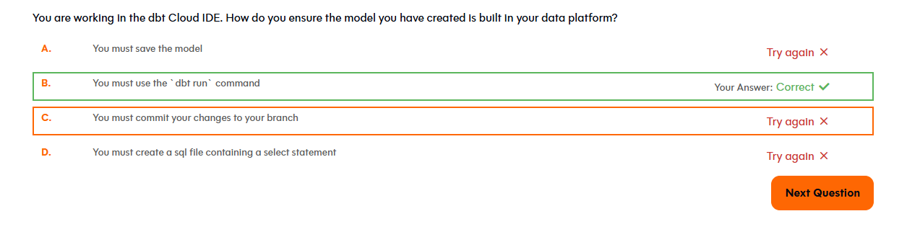
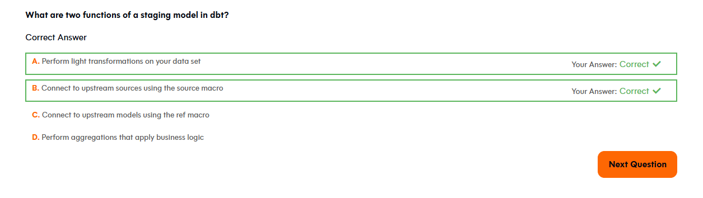
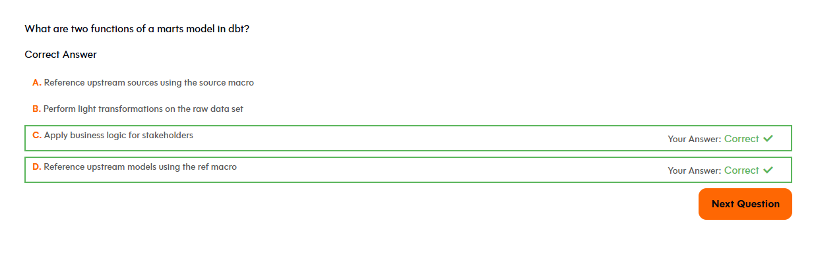
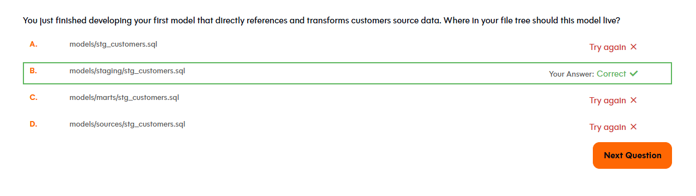
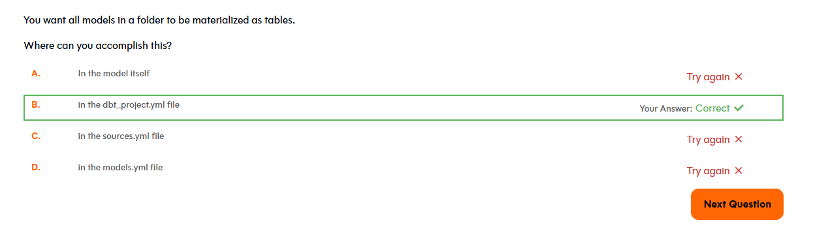
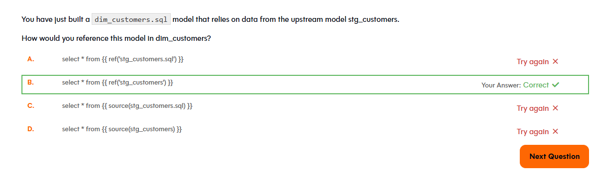
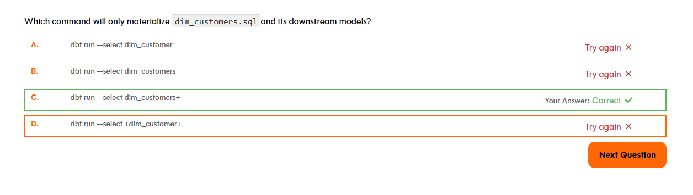
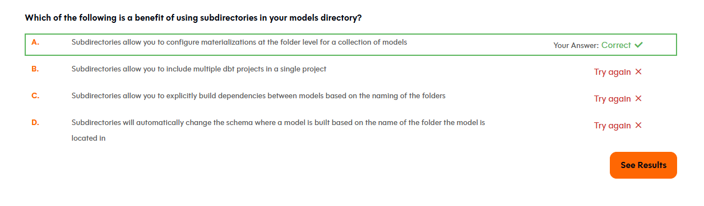


### Module 5 (Sources)
#### Practise
1. create and edit these file
    - `models/staging/jaffle_shop/_jaffle_shop__sources.yml`
        ```yml
        version: 2

        sources:
        - name: jaffle_shop
            database: raw
            schema: jaffle_shop
            freshness: 
            error_after:
                count: 10
                period: day
            warn_after:
                count: 3
                period: day
            loaded_at_field: "convert_timezone('UTC', _etl_loaded_at)"
            tables:
            - name: customers
                freshness: null
            - name: orders
        ```
    - `models/staging/stripe/_stripe__sources.yml`:
        ```yml
        version: 2

        sources:
        - name: stripe
            database: raw
            schema: stripe
            tables:
            - name: payment
                freshness:
                warn_after:
                    count: 2
                    period: day
                error_after:
                    count: 3
                    period: day
                loaded_at_field: _batched_at
        ```
2. Refactor these file to get the correct sources:
     - `models/staging/jaffle_shop/stg_jaffle_shop_customer.sql`:
        ```sql
        select
            id as customer_id,
            first_name,
            last_name

        from {{ source('jaffle_shop', 'customers') }}
        ```
    - `models/staging/jaffle_shop/stg_jaffle_shop_order.sql`:
        ```sql
        select
            id as order_id,
            user_id as customer_id,
            order_date,
            status

        from {{ source('jaffle_shop', 'orders') }}
        ```
    - `models/staging/stripe/stg_stripe__payments.sql`:
        ```sql
        select
            id as payment_id,
            orderid as order_id,
            paymentmethod as payment_method,
            status,
            amount / 100 as amount,
            created as created_at

        from {{ source('stripe', 'payment') }}
        ```


3. Then run
```bash
dbt source freshness # to check the source freshness
dbt run --full-refresh # run these model
```
#### Review
1. Sources
    - Sources represent the raw data that is loaded into the data warehouse.
    We can reference tables in our models with an explicit table name (raw.jaffle_shop.customers).
    - However, setting up Sources in dbt and referring to them with the sourcefunction enables a few important tools.
        - Multiple tables from a single source can be configured in one place.
        - Sources are easily identified as green nodes in the Lineage Graph.
        - You can use dbt source freshness to check the freshness of raw tables.


2. Configuring sources
    - Sources are configured in YML files in the models directory.
    - The following code block configures the table raw.jaffle_shop.customers and raw.jaffle_shop.orders:
        ```yml
        version: 2

        sources:
        - name: jaffle_shop
            database: raw
            schema: jaffle_shop
            tables:
            - name: customers
            - name: orders
        ```

3. Source function 
    - The ref function is used to build dependencies between models.
    - Similarly, the source function is used to build the dependency of one model to a source.
    - Given the source configuration above, the snippet {{ source('jaffle_shop','customers') }} in a model file will compile to raw.jaffle_shop.customers.
        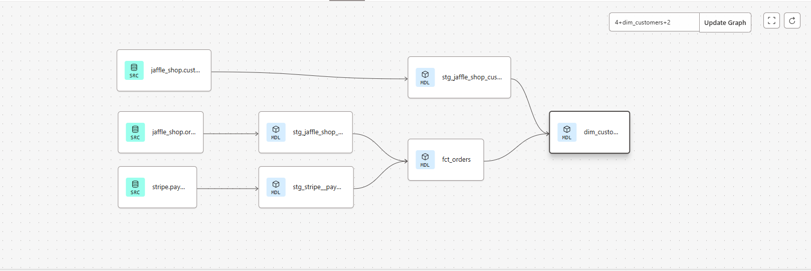


4. Source freshness

    *It is used to check whether the data is outdated. For example, if the newest record is from July 30, 2025, but today is August 1, 2025, and the freshness limit is 1 day, then the data is considered outdated. Depending on the configuration, this will raise a warning or an error.*

    - Freshness thresholds can be set in the YML file where sources are configured. For each table, the keys loaded_at_field and freshness must be configured.
        ```yml
        ersion: 2

        sources:
        - name: jaffle_shop
            database: raw
            schema: jaffle_shop
            tables:
            - name: orders
                loaded_at_field: _etl_loaded_at
                freshness:
                warn_after: {count: 12, period: hour}
                error_after: {count: 24, period: hour}
        ```
    - A threshold can be configured for giving a warning and an error with the keys warn_after and error_after.
    - The freshness of sources can then be determined with the command dbt source freshness.
### Knowledge check
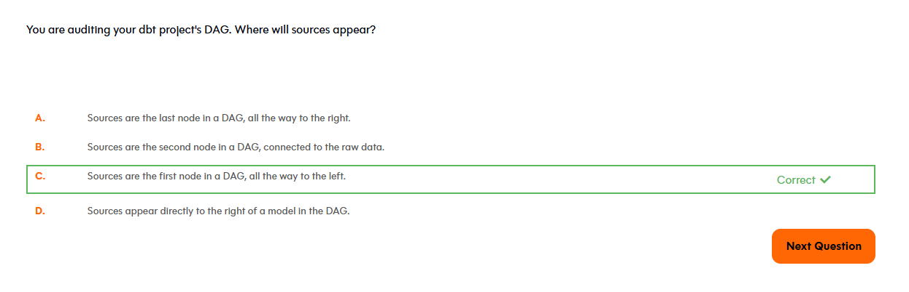
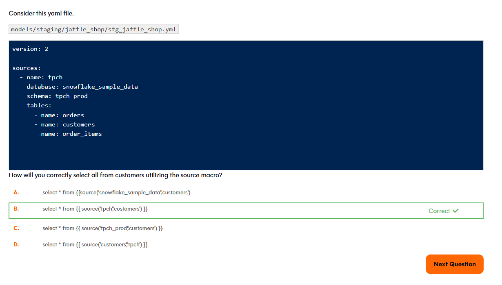
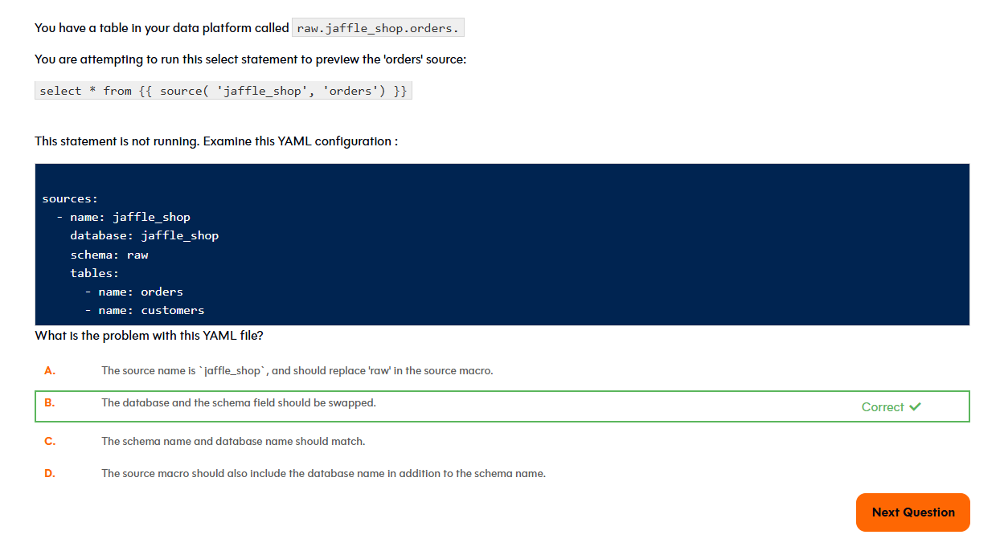
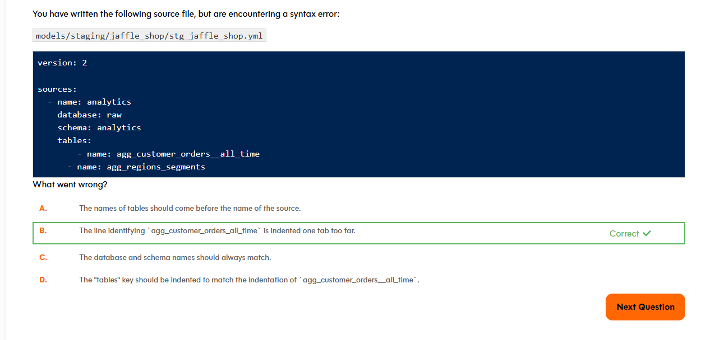
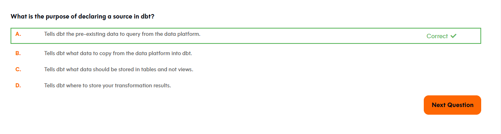
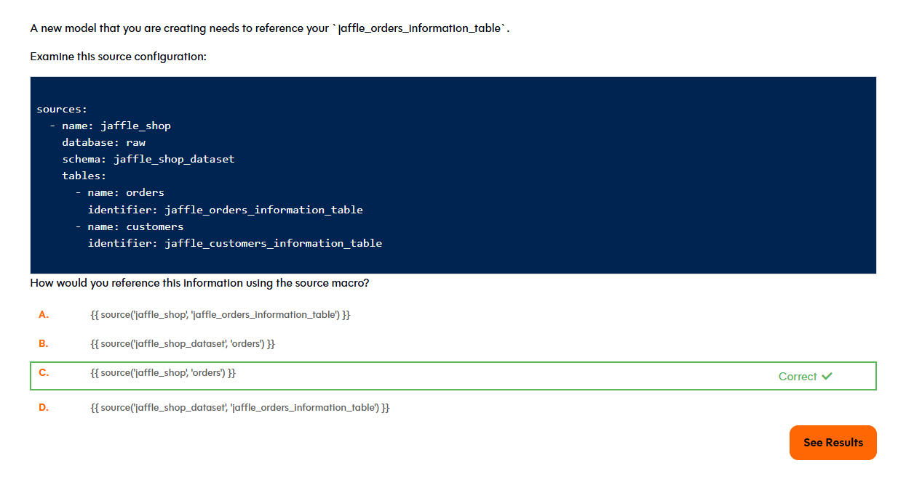


### Module 6 (Testing)
#### Practice
1. Create a generic test for the models
    - `models/staging/jaffle_shop/stg_jaffle_shop.yml`:
        ```yml
        version: 2

        models:
        - name: stg_jaffle_shop_customer
            columns:
            - name: customer_id
                tests:
                - unique
                - not_null
        - name: stg_jaffle_shop_order
            columns:
            - name: order_id
                tests:
                - unique
                - not_null
            - name: status
                tests:
                - accepted_values:
                        values: ['shipped', 'completed', 'return_pending', 'returned', 'placed']
            - name: customer_id
                tests:
                - relationships:
                    to: ref('stg_jaffle_shop_customer')
                    field: customer_id
        ```
2. Modify the source file of the jaffle_shop -> adding the source test:
    - `models/staging/jaffle_shop/_jaffle_shop__sources.yml`:
        ```yml
        version: 2

        sources:
        - name: jaffle_shop
            database: raw
            schema: jaffle_shop
            freshness: 
            error_after:
                count: 10
                period: day
            warn_after:
                count: 3
                period: day
            loaded_at_field: "convert_timezone('UTC', _etl_loaded_at)"
            tables:
            - name: customers
                freshness: null
                columns:
                - name: id
                    tests:
                    - not_null
                    - unique
            - name: orders
                columns:
                - name: id
                    tests:
                    - unique
                    - not_null
        ```

3. Create the singular test for stripe_payments (custom test in the folder test) -> Tests can be run against the right result
    - `tests/assert_stg_payment_amount_is_positive.sql`: check whether there are a bill that < 0, if this sql statement return any record, the test failed
        ```sql
        with payments as (
            select *
            from {{ ref('stg_stripe__payments') }}
        )

        select
            order_id,
            sum (amount) as total_amount
        from payments
        group by order_id
        having total_amount < 0
        ```

4. Testing
    - to test the specific model
        ```bash
        # dbt test --select <number of upstream node (optional)>+<model name>+<number of downstream node>
        dbt test --select stg_jaffle_shop_customer
        dbt test --select stg_jaffle_shop_order
        ```
    - to test the specific source
        ```bash
        # dbt test --select source:<source name>
        dbt test --select source:jaffle_shop
        ```

5. Build command: will testing source first -> materialzing models -> testing each model
    - build the whole pipeline
        ```bash
        dbt build
        ```
    - build the specific model
        ```bash
        # dbt build --select <number of upstream node (optional)>+<model name>+<number of downstream node>
        # build the current model + all its downstream
        dbt build --select dim_customer+
        # build the current model + all up/down-stream
        dbt build --select +dim_customer+
        #   buid 5 upstream model with current model + 5 downstream model
        dbt build --select 5+dim_customer+5
#### Review
1. Testing
    - Testing is used in software engineering to make sure that the code does what we expect it to.
    - In Analytics Engineering, testing allows us to make sure that the SQL transformations we write produce a model that meets our assertions.
    - In dbt, tests are written as select statements. These select statements are run against your materialized models to ensure they meet your assertions.

2. Tests in dbt
    - In dbt, there are two types of tests - generic tests and singular tests:
        - Generic tests are a way to validate your data models and ensure data quality. These tests are predefined and can be applied to any column of your data models to check for common data issues. They are written in YAML files.
        - Singular tests are data tests defined by writing specific SQL queries that return records which fail the test conditions. These tests are referred to as "singular" because they are one-off assertions that are uniquely designed for a single purpose or specific scenario within the data models.
    - dbt ships with four built in tests: unique, not null, accepted values, relationships.
        - Unique tests to see if every value in a column is unique
        - Not_null tests to see if every value in a column is not null
        - Accepted_values tests to make sure every value in a column is equal to a value in a provided list
        - Relationships tests to ensure that every value in a column exists in a column in another model (see: referential integrity)
    - Tests can be run against your current project using a range of commands:
        - `dbt test runs all tests in the dbt project`
        - `dbt test --select test_type:generic`
        - `dbt test --select test_type:singular`
        - `dbt test --select one_specific_model`
    - In development, dbt Cloud will provide a visual for your test results. Each test produces a log that you can view to investigate the test results further.
        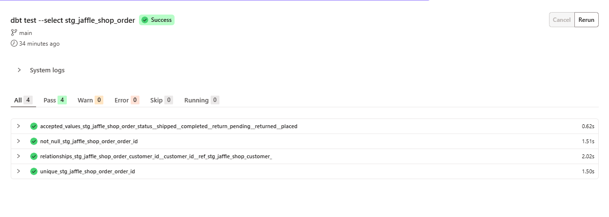
    - In production, dbt Cloud can be scheduled to run dbt test. The ‘Run History’ tab provides a similar interface for viewing the test results.
        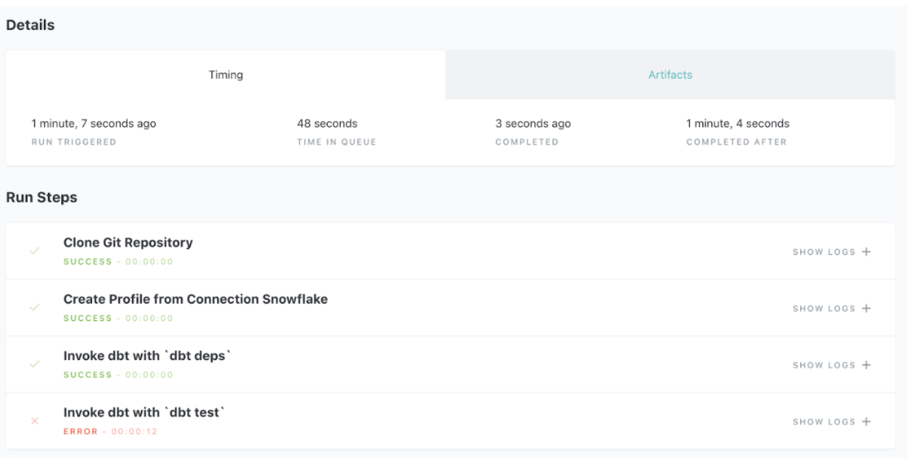
    - To assign how many node will be built or tested, using the structure
        ```
        <number of upstream node>+<current node>+<number of downstream node>

        -> it will get all of the assigned upstream + downstream + current to test and build, use it with the --select option
        ```


#### Knowledge check
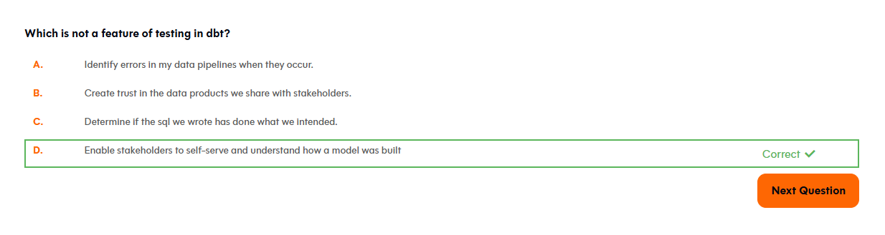
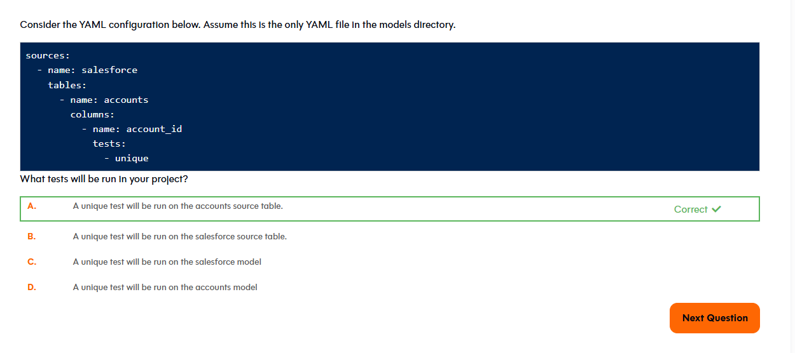
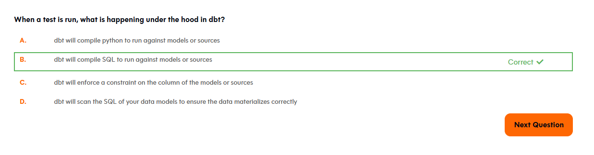
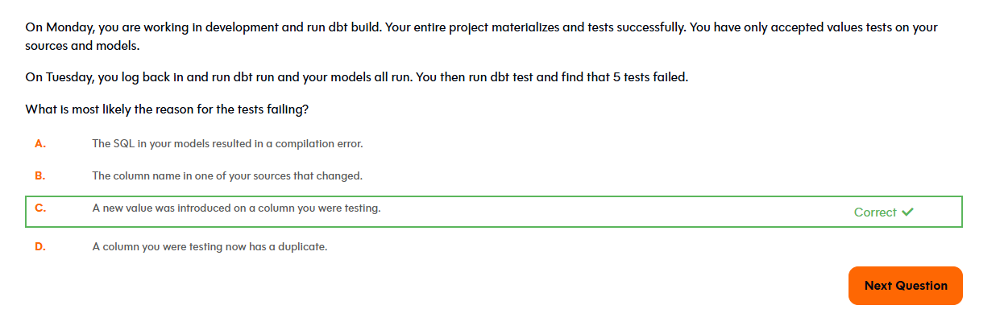
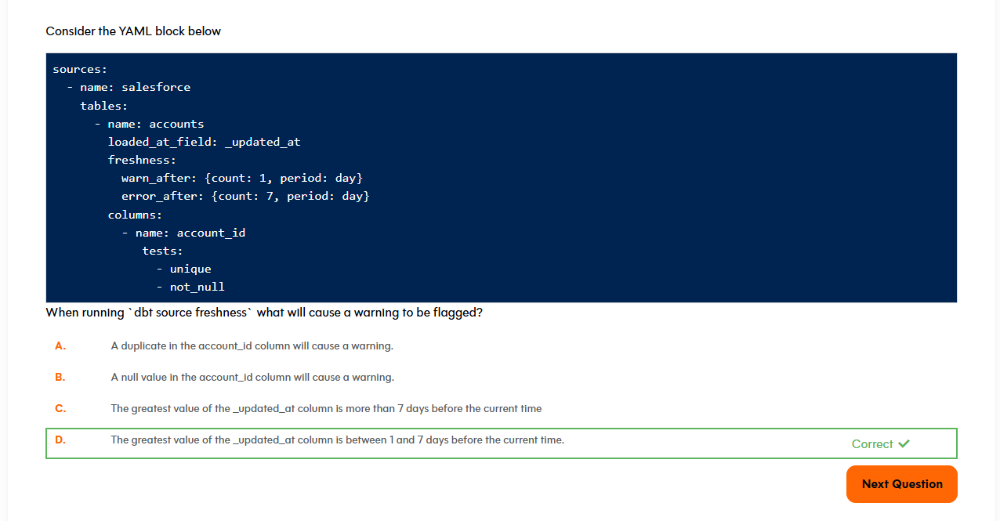
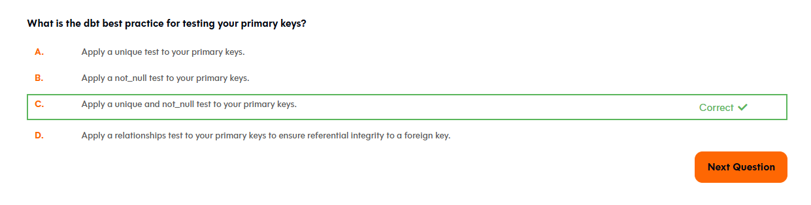
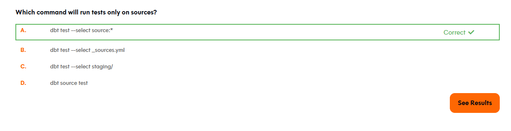
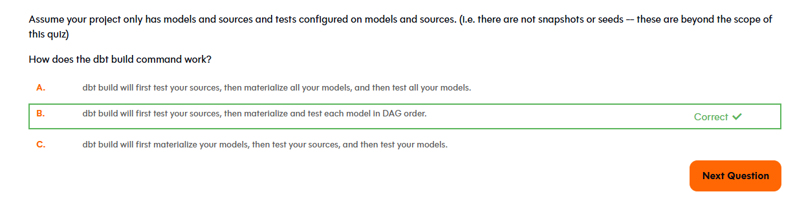

### Module 7 (Documentation)
#### Practise
1. Complete document for source and the model
    - `models/staging/jaffle_shop/stg_jaffle_shop.yml`: (for model)
        ```yml
        version: 2

        models:
        - name: stg_jaffle_shop_customer
            description: Staged customer data from our jaffle shop app.
            columns:
            - name: customer_id
                description: The primary key for customers.
                tests:
                - unique
                - not_null
        - name: stg_jaffle_shop_order
            description: Staged order data from our jaffle shop app.
            columns:
            - name: order_id
                description: Primary key for orders.
                tests:
                - unique
                - not_null
            - name: status
                description: '{{ doc("order_status") }}'
                tests:
                - accepted_values:
                        values: ['shipped', 'completed', 'return_pending', 'returned', 'placed']
            - name: customer_id
                description: Foreign key to stg_customers.customer_id.
                tests:
                - relationships:
                    to: ref('stg_jaffle_shop_customer')
                    field: customer_id
        ```
    - `models/staging/jaffle_shop/_jaffle_shop_docs.md`: (for docs_block)
        ```md
        
    
        One of the following values: 

        | status         | definition                                       |
        |----------------|--------------------------------------------------|
        | placed         | Order placed, not yet shipped                    |
        | shipped        | Order has been shipped, not yet been delivered   |
        | completed      | Order has been received by customers             |
        | return pending | Customer indicated they want to return this item |
        | returned       | Item has been returned                           |

        
        ```
    - `models/staging/jaffle_shop/_jaffle_shop__sources.yml`: (for source)
        ```yml
        version: 2

        sources:
        - name: jaffle_shop
            description: A clone of a Postgres application database.
            database: raw
            schema: jaffle_shop
            freshness: 
            error_after:
                count: 10
                period: day
            warn_after:
                count: 3
                period: day
            loaded_at_field: "convert_timezone('UTC', _etl_loaded_at)"
            tables:
            - name: customers
                description: Raw customers data.
                freshness: null
                columns:
                - name: id
                    description: Primary key for customers.
                    tests:
                    - not_null
                    - unique
            - name: orders
                description: Raw orders data.
                columns:
                - name: id
                    description: Primary key for orders.
                    tests:
                    - unique
                    - not_null
        ```
2. Run these command
    - generate docs
        ```bash
        dbt docs generate
        ```
    - view the document:
        - on the cloud, click on the view docs button (next to the change branch button):
            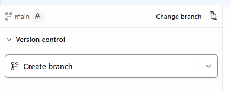
        - on the local, run:
            ```bash
            dbt docs serve
            ```

#### Review
1. Documentation
    - Documentation is essential for an analytics team to work effectively and efficiently. Strong documentation empowers users to self-service questions about data and enables new team members to on-board quickly.
    - Documentation often lags behind the code it is meant to describe. This can happen because documentation is a separate process from the coding itself that lives in another tool.
    - Therefore, documentation should be as automated as possible and happen as close as possible to the coding.
    - In dbt, models are built in SQL files. These models are documented in YML files that live in the same folder as the models.
2. Writing documentation and doc blocks
    - Documentation of models occurs in the YML files (where generic tests also live) inside the models directory. It is helpful to store the YML file in the same subfolder as the models you are documenting.
    - For models, descriptions can happen at the model, source, or column level.
    - If a longer form, more styled version of text would provide a strong description, doc blocks can be used to render markdown in the generated documentation.
3. Generating and viewing documentation
    - In the command line section, an updated version of documentation can be generated through the command dbt docs generate. This will refresh the `view docs` link in the top left corner of the Cloud IDE.
    - The generated documentation includes the following:
        - Lineage Graph
        - Model, source, and column descriptions
        - Generic tests added to a column
        - The underlying SQL code for each model
        - and more...


#### Knowledge check
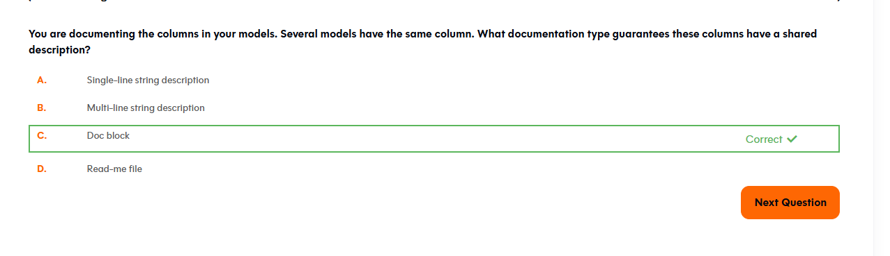
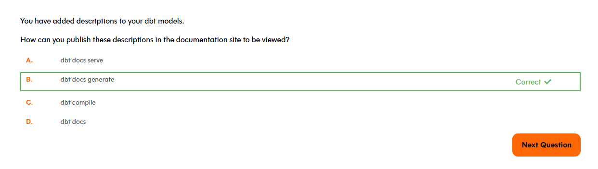
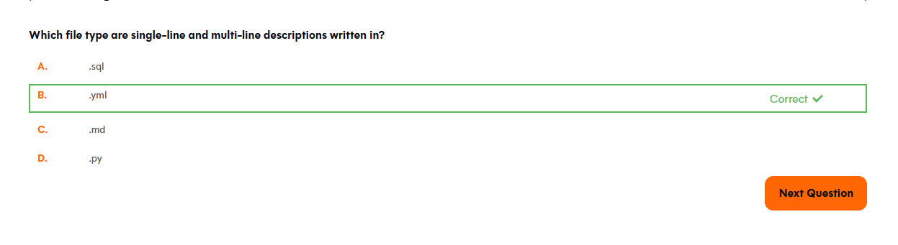
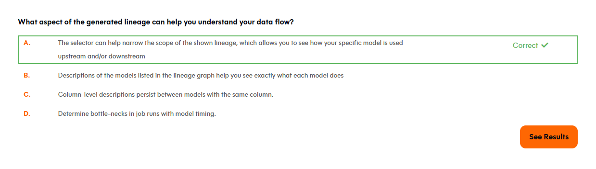

### Module 8 (Deployment)
#### Review
1. Development vs. Deployment
    - Development in dbt is the process of building, refactoring, and organizing different files in your dbt project. This is done in a development environment using a development schema (dbt_jsmith) and typically on a non-default branch (i.e. feature/customers-model, fix/date-spine-issue). After making the appropriate changes, the development branch is merged to main/master so that those changes can be used in deployment.
    - Deployment in dbt (or running dbt in production) is the process of running dbt on a schedule in a deployment environment. The deployment environment will typically run from the default branch (i.e., main, master) and use a dedicated deployment schema (e.g., dbt_prod). The models built in deployment are then used to power dashboards, reporting, and other key business decision-making processes.
    - The use of development environments and branches makes it possible to continue to build your dbt project without affecting the models, tests, and documentation that are running in production.
2. Creating your Deployment Environment
    - A deployment environment can be configured in dbt Cloud on the Environments page.
    - General Settings: You can configure which dbt version you want to use and you have the option to specify a branch other than the default branch.
    - Data Warehouse Connection: You can set data warehouse specific configurations here. For example, you may choose to use a dedicated warehouse for your production runs in Snowflake.
    - Deployment Credentials:Here is where you enter the credentials dbt will use to access your data warehouse:
        - IMPORTANT: When deploying a real dbt Project, you should set up a separate data warehouse account for this run. This should not be the same account that you personally use in development.
        - IMPORTANT: The schema used in production should be different from anyone's development schema.
3. Scheduling a job in dbt Cloud
    - Scheduling of future jobs can be configured in dbt Cloud on the Jobs page.
    - You can select the deployment environment that you created before or a different environment if needed.
    - Commands: A single job can run multiple dbt commands. For example, you can run dbt run and dbt test back to back on a schedule. You don't need to configure these as separate jobs.
    - Triggers: This section is where the schedule can be set for the particular job.
    - After a job has been created, you can manually start the job by selecting Run Now
3. Reviewing Cloud Jobs
    - The results of a particular job run can be reviewed as the job completes and over time.
    - The logs for each command can be reviewed.
    - If documentation was generated, this can be viewed.
    - If dbt source freshness was run, the results can also be viewed at the end of a job.

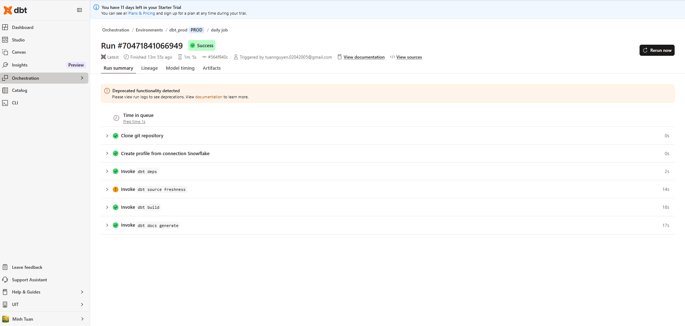
#### Knowledge check
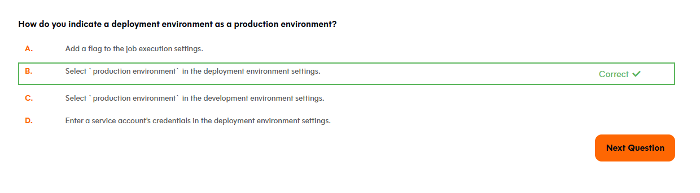
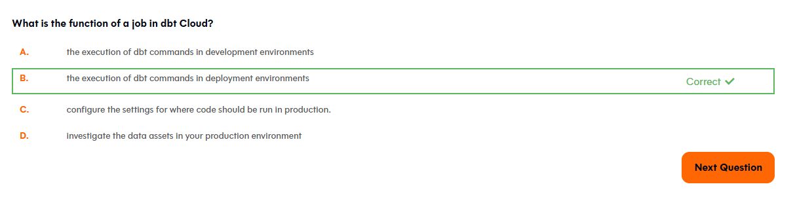
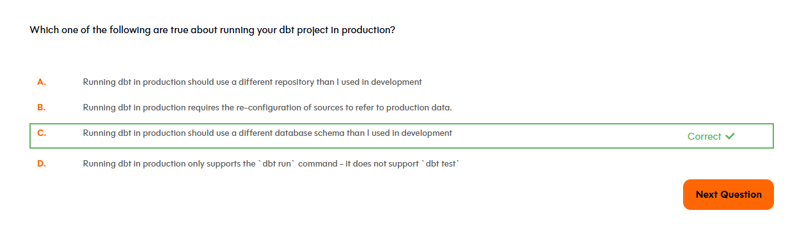
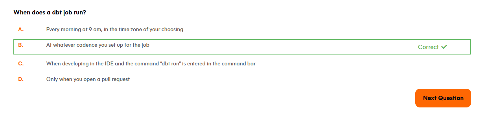
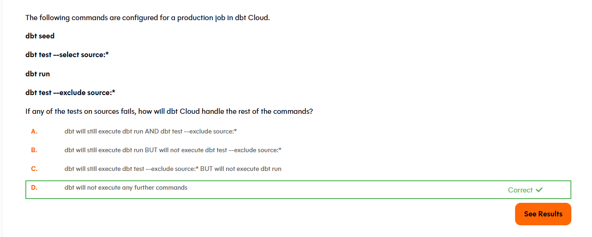

